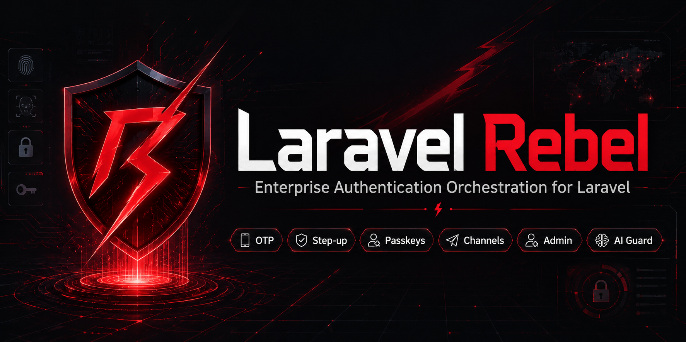

# Laravel Rebel — Bird Channel

> Official documentation: https://doc.laravel-rebel.padosoft.com


> **Send phone verifications through Bird (formerly MessageBird), the Rebel way.** This package plugs the [Bird Verify API](https://docs.bird.com/api/verify-api) (SMS OTP) and Bird SMS delivery into [`laravel-rebel-channels`](https://github.com/padosoft/laravel-rebel-channels) as a `VerificationProvider` + `MessageDeliveryChannel` — so you get Bird's global delivery *plus* Rebel's fraud guard, rate limiting, fallback and audit on top. Part of the `padosoft/laravel-rebel-*` suite.

<p align="center">
  
</p>

<p align="center">
  
  
  
  
  
  
</p>

---

## Table of contents

- [What it is](#what-it-is)
- [Quick glossary](#quick-glossary)
- [How it works (step by step)](#how-it-works-step-by-step)
- [Why this package](#why-this-package)
- [Rebel + Bird vs the alternatives](#rebel--bird-vs-the-alternatives)
- [Bird dashboard setup (step by step)](#bird-dashboard-setup-step-by-step)
- [Installation](#installation)
- [Configuration](#configuration)
- [Usage](#usage)
- [Delivery receipts (status webhook)](#delivery-receipts-status-webhook)
- [Live tests against the real API](#live-tests-against-the-real-api)
- [`.env.example`](#envexample)
- [Security notes](#security-notes)
- [🔋 Vibe coding with batteries included](#-vibe-coding-with-batteries-included)
- [Testing & License](#testing--license)

---

## What it is

A thin, well-tested **Bird Verify** provider for Rebel Channels. You don't call it directly — you
call the Channels `VerificationRouter`, and it routes through this provider (with Rebel's bot gate,
IRSF defences, per-number rate limit, fallback and audit around it).

A small **gateway seam** (`BirdGateway`) wraps Bird's REST API (Verify + Messaging) over Laravel's
HTTP client, so the whole thing is unit-testable offline and has a real **live** test-suite for the
actual API. The same provider also implements `MessageDeliveryChannel`, so you can send a plain SMS
through Bird with one call.

Depends on [`padosoft/laravel-rebel-core`](https://github.com/padosoft/laravel-rebel-core)
and [`padosoft/laravel-rebel-channels`](https://github.com/padosoft/laravel-rebel-channels).

---

## Quick glossary

| Term | In plain words |
|---|---|
| **Bird / MessageBird** | A global CPaaS (SMS / voice / WhatsApp). "Bird" is the current brand; the REST API is the former "MessageBird" one. |
| **Bird Verify** | A Bird product that sends and checks one-time codes for you — you never store or generate the OTP. |
| **Access key** | Your Bird API credential (Developers → API access). `test_…` keys hit the sandbox. |
| **Originator** | The sender id shown to the recipient: an alphanumeric name (≤11 chars) or a number you own. |
| **Verify id** | The handle Bird returns for an in-flight verification — you pass it back when checking the code. |
| **OTP** | One-Time Password — the short numeric code the user types in to prove they own the number. |

---

## How it works (step by step)

```
 user types phone               your app                 Rebel Channels            Bird Verify API
 ───────────────►  VerificationRouter::start()  ──►  BirdVerifyProvider::start  ──►  POST /verify
                                                                                       │ sends SMS OTP
                          ◄── VerificationResult::started(reference = verify id) ──────┘

 user types code               your app                 Rebel Channels            Bird Verify API
 ───────────────►  VerificationRouter::check()  ──►  BirdVerifyProvider::check  ──►  GET /verify/{id}?token=…
                          ◄── VerificationResult::approve()  /  ::deny() ─────────────┘

 Bird, later  ──►  POST /rebel/bird/status (signed)  ──►  BirdStatusController  ──►  audit: delivered / cost
```

1. **Start** — you call the router; the provider calls Bird Verify, which sends the OTP and returns
   a **verify id**. The router hands you that id as the `reference` (store it in the session).
2. **Check** — you call the router with the code the user typed and the saved reference; the provider
   asks Bird whether the token matches and returns approve / deny.
3. **Receipt** — separately, Bird calls your **status webhook** when the SMS is actually delivered (or
   fails), and the package records an audit event with the cost so the admin panel shows real numbers.

---

## Why this package

| ★ | What | In short |
|---|---|---|
| ★★★ | **Bird Verify, fully wrapped** | Start + check codes over SMS; you never handle the OTP yourself. |
| ★★★ | **Rebel guarantees for free** | Inherits the Channels fraud guard (IRSF), rate limit, fallback and HMAC'd audit. |
| ★★ | **Plain SMS too** | Implements `MessageDeliveryChannel`, so `send()` delivers any SMS through Bird. |
| ★★ | **Never throws out** | Any transport/API error becomes a clean `provider_error`, so the router can fall back to another provider. |
| ★★ | **Offline-testable** | A gateway seam + fake means your tests don't hit Bird; a separate live suite does. |
| ★★ | **Safe by default** | No access key → nothing registers, and no authenticated client is ever built. |
| ★ | **Explicit status mapping** | Bird statuses are mapped deliberately (an unexpected status is a failure, not a fake "pending"). |

---

## Rebel + Bird vs the alternatives

Sending an OTP with Bird, four ways:

| Capability | **Rebel + this package** | Shopify | Bird Verify SDK (direct) | Raw Bird SMS + your own OTP |
|---|:---:|:---:|:---:|:---:|
| Send/check a code via Bird | ✅ | ❌ | ✅ | ➖ (you build OTP logic) |
| You never store/generate the OTP | ✅ | ✅ | ✅ | ❌ |
| Anti toll-fraud / IRSF guard | ✅ | ❌ | ❌ | ❌ |
| Per-number rate limit + bot gate | ✅ | ➖ | ❌ | ❌ |
| **Provider fallback** to another vendor | ✅ | ❌ | ❌ | ❌ |
| Signed, phone-bound reference (anti replay) | ✅ | ❌ | ❌ | ❌ |
| Unified audit trail (number HMAC'd) | ✅ | ❌ | ❌ | ❌ |
| Delivery receipts + cost into the admin panel | ✅ | ❌ | ➖ | ➖ |
| Graceful failure → router fallback | ✅ | ❌ | ❌ | ❌ |

> Legend: ✅ built-in · ➖ partial / hosted-only · ❌ not available. Bird is excellent at delivery;
> this package keeps all of that and adds the Rebel fraud/routing/audit layer around it.
> Shopify is a closed, hosted commerce platform: it sends its own customer OTPs but lets you
> neither pick Bird as the sender, self-host it, fall back across vendors, nor configure its fraud
> controls — a black box, not a developer-facing verification library.

---

## Bird dashboard setup (step by step)

1. **Create a Bird account** at [bird.com](https://bird.com). The free/sandbox tier gives you a
   `test_…` access key to integrate without spending credit.
2. **Grab your access key**: in the Bird dashboard go to **Developers → API access** and copy your
   **live** access key (or a `test_…` key for the sandbox).
3. **Pick an originator**: an alphanumeric sender id (e.g. "MyApp", max 11 chars) or a phone number
   you've purchased/verified in Bird. Some countries require a registered sender id.
4. *(Optional, for receipts)* **Create a webhook subscription** for delivery status reports pointing
   at `https://<your-host>/rebel/bird/status`, and copy the **signing key** Bird shows you.
5. Put the values in your `.env` (see below). Done — the provider auto-registers.

> **Pricing:** Bird Verify is billed per verification + the channel cost. Always keep the Rebel
> **geo allowlist** (in `laravel-rebel-channels`) tight to avoid IRSF charges.

---

## Installation

```bash
composer require padosoft/laravel-rebel-channel-bird
php artisan vendor:publish --tag="rebel-channel-bird-config"
```

Add your credentials to `.env`:

```dotenv
BIRD_ACCESS_KEY=your_live_access_key
BIRD_ORIGINATOR=MyApp
```

That's it — the provider registers itself into the Channels router under the key `bird`.

---

## Configuration

File `config/rebel-channel-bird.php`:

| Key | Default | What it does |
|---|---|---|
| `access_key` | `env(BIRD_ACCESS_KEY)` | Bird API access key. **Required** for the provider to register. |
| `workspace_id` | `env(BIRD_WORKSPACE_ID)` | Reserved for Bird's newer Channels API (not used by the legacy Verify/Messaging endpoints). |
| `originator` | `env(BIRD_ORIGINATOR, 'Code')` | Sender id shown to the recipient (alphanumeric ≤11 chars, or a number you own). |
| `channels` | `['sms']` | Which Rebel channels this provider may handle. |
| `register_provider` | `true` | Auto-register into the Channels registry (when the access key exists). |
| `webhook.enabled` | `true` | Register the delivery-status webhook endpoint. |
| `webhook.validate_signature` | `true` | Validate the `MessageBird-Signature` header on the webhook. |
| `webhook.signing_key` | `env(BIRD_WEBHOOK_SIGNING_KEY)` | The signing key of your Bird webhook subscription. |
| `webhook.path` | `rebel/bird/status` | The webhook route path. |

---

## Usage

### Verify a phone number (the common case)

You typically don't touch this package directly — you use the Channels router:

```php
use Padosoft\Rebel\Channels\Enums\Channel;
use Padosoft\Rebel\Channels\Routing\VerificationRouter;
use Padosoft\Rebel\Core\Context\SecurityContext;
use Padosoft\Rebel\Core\Identifiers\PhoneIdentifier;

$router = app(VerificationRouter::class);

// Send a code (Bird Verify delivers it)
$start = $router->start(
    PhoneIdentifier::from('+39 333 1234567'),
    Channel::Sms,
    SecurityContext::fromRequest($request),
);

// Persist $start->reference (the Bird verify id) in the session for the check step.
session(['bird_ref' => $start->reference]);
```

```php
// Later — check what the user typed
$result = $router->check(
    PhoneIdentifier::from('+39 333 1234567'),
    $request->string('code'),
    session('bird_ref'),
    SecurityContext::fromRequest($request),
);

if ($result->approved()) {
    // verified!
}
```

### Force Bird specifically

```php
// config/rebel-channels.php
'providers' => ['bird'],
```

### Send a plain SMS (delivery channel)

The provider also implements `MessageDeliveryChannel`, so you can send any SMS through Bird:

```php
use Padosoft\Rebel\Channel\Bird\Contracts\BirdGateway;
use Padosoft\Rebel\Channel\Bird\Verification\BirdVerifyProvider;
use Padosoft\Rebel\Channels\Enums\Channel;
use Padosoft\Rebel\Core\Context\SecurityContext;
use Padosoft\Rebel\Core\Identifiers\PhoneIdentifier;

$provider = new BirdVerifyProvider(app(BirdGateway::class));

$delivery = $provider->send(
    PhoneIdentifier::from('+39 333 1234567'),
    'Your order has shipped!',
    Channel::Sms,
    SecurityContext::fromRequest($request),
);

if ($delivery->accepted()) {
    // queued/sent by Bird; $delivery->reference is the Bird message id.
}
```

### Handle an outage gracefully

```php
$start = $router->start($phone, Channel::Sms, $context);

if ($start->failed() && $start->reason === 'provider_error') {
    // Bird was unreachable — the router will have tried any next provider first;
    // here you can show a friendly "try again" message.
}
```

---

## Delivery receipts (status webhook)

Bird knows whether a message was actually **delivered**, **failed**, and how much it **cost** — but
only it knows, unless you let it call you back. This package ships a delivery-status webhook that
turns those callbacks into Rebel audit events, so the admin panel's **Channel Performance** can show
real delivered / failed rates and spend per channel.

**What it records.** On each callback the endpoint writes one audit event (recipient number stored
only as a keyed HMAC, never in clear):

| Bird status | Audit `event_type` |
|---|---|
| `delivered` | `channel.verification.delivered` |
| `delivery_failed`, `failed`, `expired` | `channel.verification.undelivered` |
| `sent`, `buffered`, `scheduled`, … | `channel.verification.dispatched` |

Each event carries `channel: 'sms'`, `provider: 'bird'`, the HMAC'd recipient, and a `metadata`
object:

```json
{
  "message_status": "delivered",
  "price": 0.045,
  "price_unit": "EUR",
  "message_sid": "message-xxxxxxxx",
  "error_code": null
}
```

(Bird may quote `price` as a flat number or nested under `price.amount`/`price.currency`; we store
the **absolute** value so spend sums cleanly. `price`/`error_code` are `null` when absent.)

**Set the webhook URL.** In the Bird dashboard, create a delivery-status webhook subscription
pointing at your app:

```
https://<your-host>/rebel/bird/status
```

The endpoint is enabled by default (`REBEL_BIRD_WEBHOOK=true`); set it to `false` to drop the route.
The path is configurable via `webhook.path`.

**Signature validation.** The route has **no auth middleware** — Bird posts server-to-server.
Instead, when `webhook.validate_signature` is true (default), every request must carry a valid
`MessageBird-Signature` (HMAC-SHA256 of `timestamp + URL + sha256(body)`, base64-encoded, keyed with
your subscription's signing key) plus a `MessageBird-Request-Timestamp`; a missing or forged
signature is rejected with **403** and nothing is recorded. A malformed or empty payload is
acknowledged with **204** and recorded as nothing, so a junk callback never 500s.

```dotenv
REBEL_BIRD_WEBHOOK=true             # register the /rebel/bird/status route
REBEL_BIRD_WEBHOOK_VALIDATE=true    # verify MessageBird-Signature
BIRD_WEBHOOK_SIGNING_KEY=...        # from your webhook subscription
REBEL_BIRD_WEBHOOK_PATH=rebel/bird/status
```

> Build now, wire live later: the endpoint and its audit events exist today, so you can simulate
> Bird callbacks (the test suite does exactly that) and the admin aggregates real delivered/cost
> data as soon as you point a Bird webhook subscription at it.

---

## Live tests against the real API

The offline suite fakes the gateway (`Http::fake()` for the REST gateway, `FakeBirdGateway` for the
provider). To exercise the **real** Bird Verify API (`tests/Live`), opt in explicitly — it **sends a
real message**:

```bash
# .env (or shell env)
REBEL_BIRD_LIVE=1
BIRD_ACCESS_KEY=your_live_access_key
BIRD_ORIGINATOR=MyApp
BIRD_TEST_PHONE=+39XXXXXXXXXX

vendor/bin/pest --group=live
```

Without `REBEL_BIRD_LIVE=1` or with any credential missing, the live tests **self-skip**, so
`composer test` and external PRs never trigger a send. In CI, supply the values as **secrets** and
set `REBEL_BIRD_LIVE=1` on a dedicated job.

---

## `.env.example`

```dotenv
BIRD_ACCESS_KEY=your_live_access_key
BIRD_ORIGINATOR=MyApp
BIRD_WORKSPACE_ID=
REBEL_BIRD_REGISTER=true

REBEL_BIRD_WEBHOOK=true
REBEL_BIRD_WEBHOOK_VALIDATE=true
BIRD_WEBHOOK_SIGNING_KEY=your_webhook_signing_key
REBEL_BIRD_WEBHOOK_PATH=rebel/bird/status

# Live tests (opt-in: SENDS A REAL MESSAGE)
REBEL_BIRD_LIVE=0
BIRD_TEST_PHONE=+391234567890
```

---

## Security notes

- **No unauthenticated client**: the Bird gateway is only constructed when `access_key` is present.
- **No exception leakage**: transport/API errors are caught and returned as a generic
  `provider_error` — Bird internals never bubble up to your app or logs.
- **Explicit status mapping**: only Bird's `sent` is treated as a live challenge; any unexpected
  status fails closed.
- **No PII in clear**: the recipient number is stored only as a keyed HMAC in the audit trail; OTPs
  are never logged.
- **Keep IRSF defences on**: pair this with the Channels geo allowlist / per-prefix cap to avoid
  premium-rate fraud charges.

---

## 🔋 Vibe coding with batteries included

This package ships **AI batteries** — so you (and your AI agent) can extend it correctly on the
first try:

- **`CLAUDE.md`** — a concise AI working guide (purpose, conventions, architecture, how to extend,
  Definition of Done). Plain Markdown, so Claude Code, Cursor, Copilot and Codex all read it.
- **`AGENTS.md`** — the agent/workflow contract (branch → PR → CI → tag/release, the gates).
- **`.claude/skills/`** — invocable skills (at least `rebel-package-dev`) encoding the suite's
  TDD loop, the **PHPStan-level-max** recipes, the security/telemetry rules, and the release
  discipline.

Open the repo in your AI editor and just start — the rules, guardrails and extension recipes come
with it. PRs that follow the shipped `CLAUDE.md` pass CI (PHPStan max + Pest + Pint) and review the
first time around.

## Testing & License

```bash
composer test      # Pest (provider + gateway + webhook + Channels integration; live suite self-skips)
composer phpstan   # static analysis, level max
composer pint      # code style
```

**License:** MIT — see [LICENSE](LICENSE). Part of the [`padosoft/laravel-rebel`](https://github.com/padosoft) suite.

